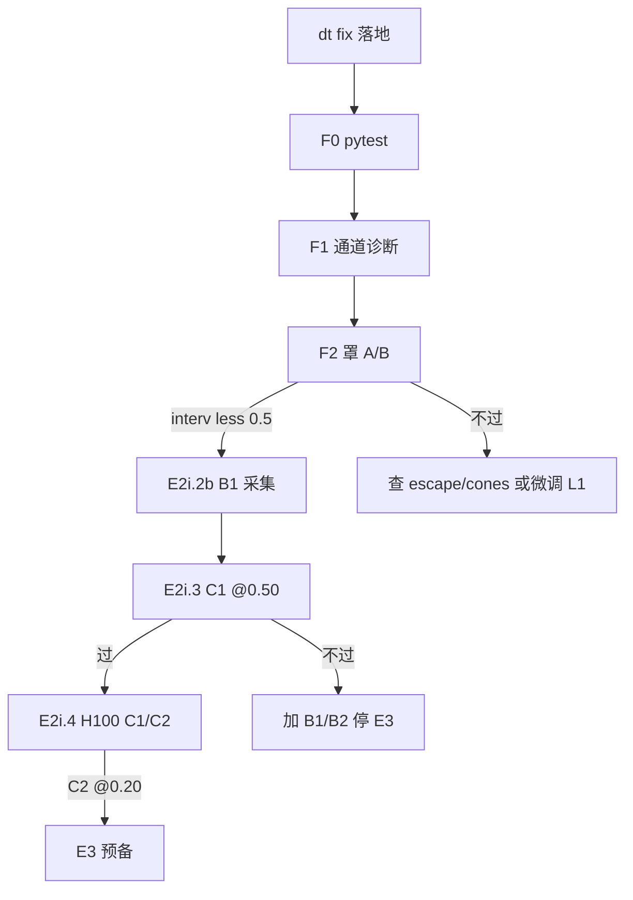

# Indoor WAM — E2i dt 修复后完整方案（2026-08-31）

> **前置诊断**：`artifacts/indoor_shield_channel_diag_v3_seed0_20260831.json`  
> **根因**：`_dt_from_limits = limits[0]/MAX_BODY_VELOCITY[0] = 0.15/5 = 0.03s` → 巡航 `max_dx≈0.022`≪策略 `0.15` → 永久 `three_zone` + `sustained_escape`。

---

## 0. 一句话

**先修 dt 尺度（代码已改），再同 ckpt 重跑罩 A/B；过 intervention&lt;0.5 后才开 B1；B2 语料已齐可并行进 C1 准备。**

---

## 1. 已落地修复（本轮）

### 代码

`experiments/aerial/rl/safety.py` → `ThreeZoneSpeedShield._dt_from_limits`：

```text
旧：dt = limits[0] / MAX_BODY_VELOCITY[0]   # 室内 0.15/5 = 0.03 ❌
新：dt = limits[0] / zone.v_cruise_m_s      # 室内 0.15/0.75 = 0.20 ✅
                                          # 室外 1.0/5.0   = 0.20 ✅
```

语义：开阔处 `v_cap=v_cruise` ⇒ `max_dx=limits[0]` ⇒ **不再误介入**；近障 `v_cap<v_cruise` ⇒ 仍按比例限速。

### 栈纪律（重要）

室内 workspace 保持 **HEAD 系** `safety.py`（~321 行）+ `three_zone.py`（cruise **5** / 166 行）。  
**禁止**从 `aerial-wam-v2` 整文件覆盖（v2 默认 cruise **25** + `engage_outer_for_speed`，与室内 micro yaml 不兼容）。

### 单测

`test_indoor_micro_limits_open_space_no_false_cap` — 开阔 `depth=5` 不 cap；近场 `depth=0.3` 仍 cap。  
**F0**：`pytest experiments/aerial/rl/tests/test_three_zone_shield.py` → **6 passed**（Mac + 125）。

### 纪律

- **未剥** D̂ / τ / p_coll 通道；仅修正速度→位移换算。  
- 完成态仍 **罩 ON**；禁关罩刷分。

---

## 2. 立即验证链（125 · 需 AirSim / Building_99）

| 步 | 内容 | 过门 | 估时 |
|----|------|------|------|
| **F0** | 同步 `safety.py` + 单测到 125；`pytest test_three_zone_shield.py` | 全绿 | 5 min |
| **F1** | 通道诊断复跑（v3 cfg，routes 0–3，`--max-steps 80`） | `intervention` 在开阔段显著↓；主通道不再「开阔仍 three_zone」 | 15 min |
| **F2** | 罩 A/B：`baseline` vs `v3`（或 v2 vs v3），e2h4 ckpt，8×3 seed @0.20 | intervention_mean **&lt;0.5**；d_end 不差于修前；collision 不恶化 | ~40 min |

F2 过门后：**E2i.1 正式过** → 解禁 B1。

### F1/F2 实测（2026-08-31 post-dtfix）

| | 结果 |
|--|------|
| **F1** v3 routes 0–3 | interv **0.00**×4；channels 空；`frac_pred<L1=0` |
| **F2** baseline vs v3 | old interv **0.706** / new **0.048**；d_end **6.23→3.25**（↓**47.8%**） |
| gates | `gate_intervention_lt_0_5` ✅ · `gate_d_end_improve_gt_30pct` ✅ |
| 工件 | `artifacts/indoor_shield_channel_diag_v3_post_dtfix_20260831.json` · `artifacts/indoor_shield_ab_summary_post_dtfix_20260831.json` |

说明：baseline 仍高介入，因 L1=1.5m 相对室内 lobby 过宽（非 dt）；**采用 v3 为部署罩**。collision 仍高 / arrived≈0 → 下一刀靠 **B1 语料 + FT**，不是再缩 zone。

脚本：

```bash
# F1
$AERIAL_PY experiments/aerial/scripts/indoor_shield_channel_diag.py \
  --config configs/aerial_rl_indoor_shield_v3.yaml \
  --actor-ckpt experiments/aerial/rl/artifacts/v4_ac_ckpt_indoor_e2h4_20260831/v4_ac_latest.pt \
  --out artifacts/indoor_shield_channel_diag_v3_post_dtfix_20260831.json

# F2
bash experiments/aerial/scripts/run_e2i_shield_ab.sh \
  experiments/aerial/rl/artifacts/v4_ac_ckpt_indoor_e2h4_20260831/v4_ac_latest.pt \
  configs/aerial_rl_indoor_shield_e2h_baseline.yaml \
  configs/aerial_rl_indoor_shield_v3.yaml
# 或改脚本 new 臂为 v3；summary → indoor_shield_ab_post_dtfix_*.json
```

---

## 3. 过门后主航道（E2i 续）

```text
F2 ✅
  ├─ E2i.2b B1：assist=none + 新罩 + keep-near-success（需 AirSim）
  │     annotation=building99_indoor_short_routes.json
  │     ≥50 usable；禁室外 annotation
  ├─ E2i.2a B2：✅ 已有 34 arrived @0.20（可直接用）
  └─ E2i.3 C1：混合 B1≥50% + B2≤30% + 旧101≤20%
        FT --skip-collect（不占 AirSim）@4090 500 iter
        eval @0.50 罩 ON（需 AirSim）
              ↓ 过
        E2i.4 H100 长 FT（h100-26: a25689@10.239.121.26 -p 31126）
              C1≥2000 → C2≥1000 → 合同 @0.20
```

### 数据资产（已有）

| 集 | 路径 | 状态 |
|----|------|------|
| 旧夹具 @0.50 | `dataset_indoor_building99_e2h_20260830`（101） | 辅料 ≤20% |
| B2 @0.20 | `dataset_indoor_b99_fixture_020_20260831`（34） | ✅ 可用 |
| B1 near | 待 E2i.2b | 阻塞于 F2 |

### 罩规格建议（F2 默认 new 臂）

继续用 **`configs/aerial_rl_indoor_shield_v3.yaml`**（L1=0.45）。dt 修好后若 intervention 已 &lt;0.5，不必再缩 L1；若仍偏高再微调 L1/v2，**禁止**再靠缩 zone「赌」dt bug。

---

## 4. 若 F2 仍不过

| 现象 | 动作 |
|------|------|
| intervention 仍高且通道仍是 three_zone、D̂≫L1 | 查 `depth_cones` / sustained_escape 阈值；考虑提高 `deadlock_thresh` 或 escape 条件（次优先） |
| intervention 低但 d_end 更差 / collision↑ | 略增 L1（0.45→0.6）保安全，再 A/B |
| τ / p_coll 主导 | 室内关 τ 或抬 `min_tau_s`（诊断后） |

---

## 5. AirSim / 机器

| 任务 | AirSim | 机器 |
|------|--------|------|
| F0 单测 | 否 | Mac / 125 |
| F1/F2 / B1 采集 / 合同 eval | **是** Building_99 | 125 |
| C1/C2 FT `--skip-collect` | **否** | 125 4090 / **H100 `.26`** |
| Phase-2 outdoor | 互斥；室内刀完 `recover_renderer_scene.sh outdoor` | 125 |

H100：`ssh a25689@10.239.121.26 -p 31126`（经 125：`ssh h100-26`）。

---

## 6. 决策流



---

*Mac Agent · 2026-08-31 · 人令：先修复 + 完整方案*
