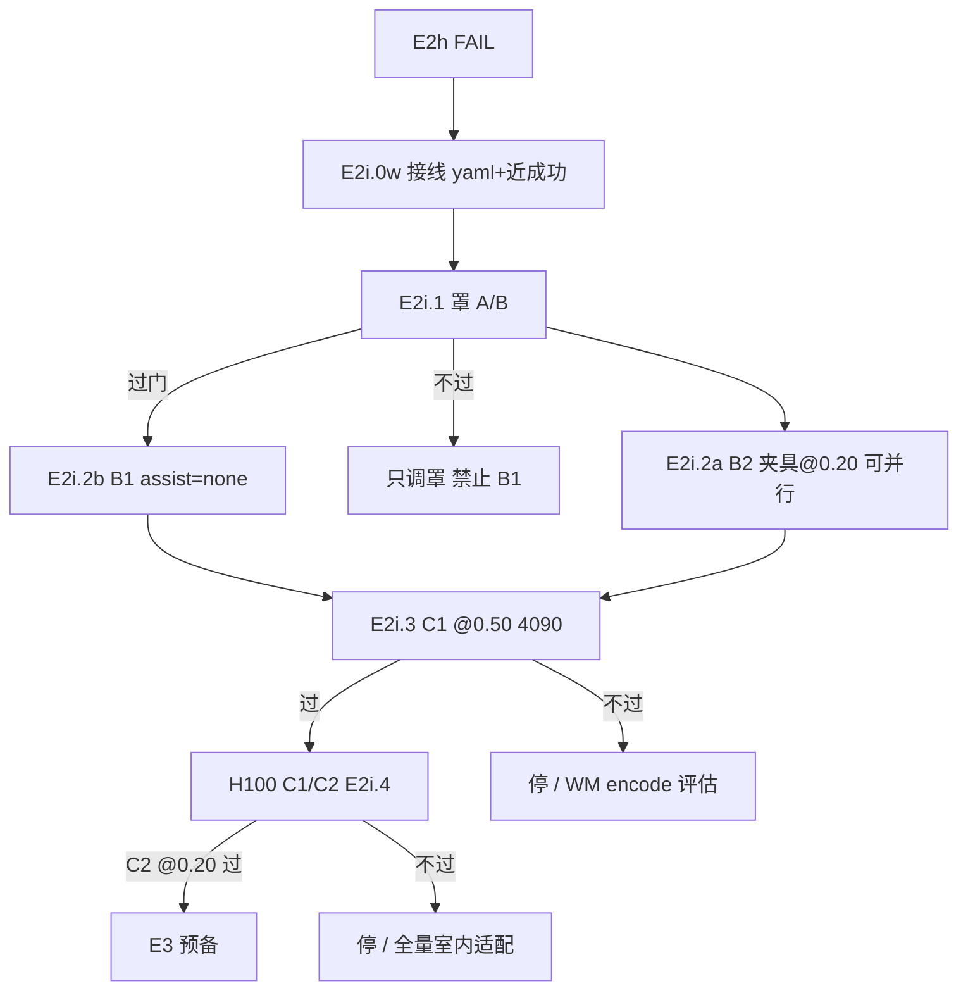

# Indoor WAM — E2i 问题分析与下一步计划（2026-08-31 · 修订 v2）

> **Workspace**：`/home/yao/aerial-indoor-wam`  
> **权威链**：本文件（分析+计划）→ [`RUNBOOK_indoor_0xm.md`](../../experiments/aerial/RUNBOOK_indoor_0xm.md) §8.9 → [`INDOOR_0XM_STATUS.md`](INDOOR_0XM_STATUS.md)  
> **致命缺陷（结构）**：[`INDOOR_FATAL_DEFECTS_20260831.md`](INDOOR_FATAL_DEFECTS_20260831.md) — F1 夹具主料 / F2 gt_proxy / F3 罩导航 / F4 域尺度 / F5 指标污染  
> **前置**：E2h 已结案（场景合格）但合同 FAIL；工件见 §8。  
> **修订 v2**：按 08-31 审查结论修正命令错误、执行顺序、过门指标与接线清单。

---

## 0. 一句话

**场景问题已修，但 101 条夹具 @0.50 语料 + 4090×500 iter FT 仍 0/3 @0.20**；shield-off best **0.63 m 且 collided** ⇒ **罩是主瓶颈之一，π 本体也还不会干净 0.x m 收口**。下一刀 **E2i**（**严格顺序**）：**接线 + 罩重标定 → B2 夹具 ∥ B1 主轨 → 分阶 H100 FT**。

---

## 1. 当前最大问题（诚实排序）

### P0 — 训练–部署–评测 三处尺度/域不一致

| 维度 | 室外 baseline | 当前室内实际 | 后果 |
|------|---------------|--------------|------|
| **场景** | `env_airsim_16` 开阔/长距 | Building_99 近障 | WM encode 视觉域错 |
| **段长/到达** | ~30 m / ~3 m | 3–6 m / **0.2 m** | π 近场行为未进训练分布 |
| **语料来源** | 室外闭环 + HER | **101 条几乎全是 GT-PD 夹具 @0.50** | FT 学的是「看夹具飞」，不是 `assist=none` 收口 |
| **安全罩** | 室外巡航标定 | 室内 3 m 段、微步长 | **介入率≈1.0**，π 指令被盖掉 |
| **罩参数来源** | yaml 有 indoor 分支 | eval/collect **hardcode** `ThreeZoneSpec` | A/B 标定无法复现、难维护 |

E2h.4 已证明：**不是「再加几条同规格数据」就能过**；根因是 **室外权重 + 错误语料形态 + 罩参数不匹配 + 脚本未接 yaml** 叠在一起。

### P1 — 安全罩在室内是硬瓶颈（已测，不是猜）

`E2h.diag` shield-off（**仅诊断，非完成态**）：

| 条件 | best min d_end | collided? | 到点 @0.20 |
|------|----------------|-----------|------------|
| 罩 ON（合同） | ~1.78 m | 多数未撞、但进不了圈 | 0/3 |
| 罩 OFF | **0.63 m**（seed1 R06） | **是**（best 两行均 collided） | 0/3 |

**解读**：

- **罩 ON**：近场被接管，π 学不到、也测不到真实收口能力。
- **罩 OFF**：π 能 **撞近** 到 ~0.6 m，但 **非干净到点** → π 本体也有缺口；不能把 0.63 m 当「π 已会近场」。

**最大单一可行动问题 = 室内近场「π + 罩」联合不可达**；只修一个不够。E2i.1 过门 **必须同时看 d_end 与 collision**，禁止用「允许撞近」冒充进展。

工件：`artifacts/indoor_shield_off_diag_summary_20260831.json`

### P2 — 评测合同仍偏乐观

主线大量仍用 `gt_proxy` 算 `goal_rel`。在 stub 位姿下都 0/3，切真 VIO/odom（E3）只会更难 → **E3 仍禁**。

### 已排除 / 降权

| 假设 | 结论 |
|------|------|
| 动力学不可达 | ❌ 夹具 @0.50 能进圈 |
| 单纯缺数据 | ❌ 101 NPZ 已 FT 两次仍 FAIL |
| 室外路切段能救 | ❌ E2 审计已 FAIL |
| 零重训室外 ckpt 直室内 0.x m | ❌ E2e/E2f/E2h 全 FAIL |
| 只调罩就能过 @0.20 | ❌ shield-off 仍 0/3 且靠碰撞 |

---

## 2. 要不要重训？

| 层级 | 是否需要 | 理由 |
|------|----------|------|
| **零重训，室外 ckpt 直接室内 0.x m** | ❌ | E2e/E2f/E2h 全 FAIL；E2d 仅 @0.50 脆过 |
| **室外 init + 室内域 FT（Stick 主航道）** | ✅ **必须** | 同脑、改尺度与语料分布，**全分布 FT** |
| **WM+π 从零重训** | ⚠️ 未证必要 | 101 条 + 500 iter @4090 不够；H100 大规模 FT 仍 FAIL 再议 |

**诚实结论**：需要 **室内适配训练**，不是简单加数据；4090×500 iter×101 ep **不算重训**。**C2 @0.20 过门无保证**，但 E2i 是当前 Stick 内最合理下一刀。

---

## 3. 问题演进（数字链）

```text
室外 ckpt 直评 @0.20        → 0%
室外短段 FT + HER @0.50      → 50% 脆过（E2d，室外域）
室外 + 夹具 BC @0.20         → 0/3（E2f）
室内 Building_99 101条 FT    → 0/3 @0.20（E2h.4）
                              best ~1.5–2.8 m（罩 ON）
shield-off 同 ckpt            → best 0.63 m collided，仍 0/3
```

---

## 4. 解决方案（Stick 主航道内）

```text
问题链：室外 π/WM → 室内视觉域 + 近场尺度 + 罩全接管 → 0/3 @0.20

解法链（必须按序，不可跳）：
  ⓪ 125 接线：yaml→eval/collect 统一读罩；B1 近成功过滤
  ① 室内化三区罩参数（降介入，保留安全）+ 同 ckpt A/B
  ② 语料双轨：B2 夹具 @0.20（可与①并行）→ B1 assist=none 近成功（①过门后）
  ③ 分阶 FT：先 @0.50 稳，再 @0.20
  ④ H100 长 FT（π；必要时 WM encode 室内微调）
  ⑤ 合同评 assist=none、罩 ON；仍 gt_proxy 直到 ①–④ 过门
  ⑥ 再议 E3（真 p̂）
```

### 方案 ⓪ — 125 接线（P0，阻塞后续）

| 项 | 现状 | 要求 |
|----|------|------|
| 罩参数 | `configs/aerial_rl_indoor_lossless.yaml` 已有 `safety.*` | `indoor_mainline_baseline_eval.py`、`indoor_loop_collect.py` 改读 yaml（`ThreeZoneSpec.from_mapping`），禁 hardcode |
| B1 近成功 | 无 `--keep-near-success` | 实现 **或** 采集后脚本过滤 `d_end_m_gt<1.0` 且 `collided=false` 落盘 |
| eval 诊断 | 已有 `--shield-off` | 保留；**不得**写入完成态 |

### 方案 A — 室内罩重标定（P0，B1 之前必做）

**做什么**：按 Building_99 深度分布（中位 ~2.2 m、段长 3 m）在 yaml 重冻 `ThreeZoneSpec`：

- 降低 `v_cruise`、放宽外圈 L1/L2，使 **3 m 段上 intervention_rate 目标 <0.4**
- 落盘 per-step `intervention_rate`；可选 `_breached` 三通道诊断

**A/B**：**不重训**，`e2h4` ckpt、8 lobby 路由 × 3 seed、罩 ON，旧 spec vs 新 spec。

**过门**（全部满足）：

1. `intervention_mean < 0.5`（相对 E2h.4 ~1.0 显著下降）
2. `mean_d_end` 相对 E2h.4 **下降 >30%**
3. **`collision_rate` 不高于 E2h.4**（或 `min_d_end` 改善来自非碰撞 episode）
4. 仍 **0/3 @0.20 可接受** — 本步只证「罩不再锁死 π」，不证合同过门

**纪律**：诊断可 `--shield-off`；**完成态仍罩 ON**。

### 方案 B — 语料双轨（P0，分两段执行）

| 轨 | 时机 | 内容 | 目标量 | 备注 |
|----|------|------|--------|------|
| **B2 辅轨** | **E2i.1 期间可并行** | 夹具 `gt_pd_body`、`success=0.20`、`keep-arrived-only` | ≥20 arrived | **无 WAM/罩**；`max-intervention-rate` **不适用** |
| **B1 主轨** | **E2i.1 过门后** | Building_99、`assist=none`、3 m、**新罩 spec**、保留近成功 | ≥50 usable | 必须 `--annotation building99_indoor_short_routes.json` |

**B1 保留条件**（二选一，125 接线后统一）：

- 脚本：`--keep-near-success --near-success-max-m 1.0 --drop-collided`
- 或后处理：`d_end_m_gt < 1.0` 且 `collided == false`

**禁止**：再堆 `success=0.50` 夹具 BC 当进展；B2 在 FT 混合中 **≤30%**。

### 方案 C — 分阶 FT + H100（P1）

| 阶段 | init | 数据混合（写死比例） | 训练 `success_dist_m` | 评测 |
|------|------|----------------------|------------------------|------|
| **C1** | `e2f` 或 `e2h4` | B1 **≥50%** + B2 **≤30%** + 旧 101 **≤20%** | **0.50** | Building_99 8 路由 × 3 seed @0.50 |
| **C2** | C1 ckpt | B2 @0.20 **≥50%** + B1 近成功 **≥30%** + 旧 101 **≤20%** | **0.20** | 合同 @0.20 |

- **4090**：冒烟 / 500 iter 快验（**不占 AirSim** 若 `--skip-collect --dataset`**）
- **H100**：C1/C2 各 **≥2000 iter / ≥1000 iter**（500 iter 不算重训）

可选：**WM encode 室内短窗微调**（C1 后 encode 域 gap 仍明显时）。

### 方案 D — 仍不做的事

- 禁 E3（odom）直到 C2 在 `gt_proxy` 下过门  
- 禁关罩刷完成态  
- 禁 A*/GT-PD 当默认飞行核或 eval `assist`  
- 禁室外 `seen_airsim16_m1a20.json` 路由混进室内 B1/B2  
- 禁改 `safety.py` deploy 逻辑（5ao 未签）；**仅调 yaml `ThreeZoneSpec` 数值**

---

## 5. 下一步计划 — 阶段 E2i

### E2i.0 — 冻结诊断（文档）

- [x] 本文件 v2 + RUNBOOK §8.9 + STATUS  
- [ ] 可选：`INDOOR_E2H_REPORT_20260831.md`（E2h.3/E2h.4/shield-off 汇总）  
- [x] **E2h 停**；根因 = 罩 + π 近场 + 语料形态 + 脚本 hardcode  

### E2i.0w — 125 接线（Mac 可 PR，125 须 merge 后再采）

- [ ] `indoor_mainline_baseline_eval.py` / `indoor_loop_collect.py`：罩从 `configs/aerial_rl_indoor_lossless.yaml` 读取  
- [ ] `indoor_loop_collect.py`：`--keep-near-success` / `--near-success-max-m` / `--drop-collided`（或独立 `indoor_filter_near_success.py`）  
- [ ] 新增 `run_e2i_shield_ab.sh`：旧/新罩同 ckpt 对比，输出 `artifacts/indoor_shield_ab_20260831.json`  

### E2i.1 — 室内罩重标定（125 · 1–2 天）

- [ ] Building_99 `depth_min` 分布 + intervention 逐步曲线  
- [ ] 更新 yaml `safety.l1_m/l2_m/l3_m/v_*`（落盘 git + 125 同步）  
- [ ] A/B：`v4_ac_ckpt_indoor_e2h4_20260831`，8 lobby × 3 seed @0.20，罩 ON  
- [ ] 过门：§4 方案 A 四条  

### E2i.2a — B2 夹具 @0.20（125 · 可与 E2i.1 并行 · **需 AirSim**）

```bash
source experiments/aerial/scripts/env_4090.sh
export AIRSIM_CAMERA=0 AIRSIM_VEHICLE=drone_1
bash experiments/aerial/scripts/recover_renderer_scene.sh building99

$AERIAL_PY experiments/aerial/scripts/indoor_building99_fixture_collect.py \
  --annotation artifacts/building99_indoor_short_routes.json \
  --success-dist 0.20 \
  --segment-len-m 3.0 \
  --max-steps 140 \
  --keep-arrived-only \
  --episodes 80 \
  --min-usable 20 \
  --out experiments/aerial/rl/artifacts/dataset_indoor_b99_fixture_020_20260831
```

- [ ] 过门：`n_arrived ≥ 20`；`collection_summary.json` 写 `scene=Building_99`、`bc_tag=gt_pd_body_020`  
- [ ] 若 @0.20 量不足：允许 `--success-dist 0.30` 过渡采集，但 **C2 主料仍须 @0.20 arrived**（不得冒充）

### E2i.2b — B1 assist=none 近成功（125 · **E2i.1 过门后** · **需 AirSim**）

```bash
source experiments/aerial/scripts/env_4090.sh
export AIRSIM_CAMERA=0 AIRSIM_VEHICLE=drone_1
bash experiments/aerial/scripts/recover_renderer_scene.sh building99

$AERIAL_PY experiments/aerial/scripts/indoor_loop_collect.py \
  --annotation artifacts/building99_indoor_short_routes.json \
  --routes 0,1,2,3,4,5,6,7 \
  --pose-source gt_proxy --assist none \
  --segment-len-m 3.0 --success-dist 0.50 \
  --max-intervention-rate 0.55 \
  --keep-near-success --near-success-max-m 1.0 --drop-collided \
  --episodes 120 --min-usable 50 \
  --actor-ckpt experiments/aerial/rl/artifacts/v4_ac_ckpt_indoor_e2h4_20260831/v4_ac_latest.pt \
  --out experiments/aerial/rl/artifacts/dataset_indoor_b99_none_near_20260831
```

> **接线未就绪时**：去掉 `--keep-near-success*` 先采 raw，再  
> `python3 experiments/aerial/scripts/indoor_filter_near_success.py --in ... --out ... --max-d-end 1.0 --require-no-collision`  
> （125 Agent 须实现 filter 脚本若 collect flag 未合并）

- [ ] 过门：usable **≥50**；meta `assist=none`、`pose_source=gt_proxy`、`shield_spec=<yaml hash>`

### E2i.3 — C1 短 FT @4090（125 · 1 天 · **FT 不占 AirSim**）

```bash
# 混合数据集目录由 125 写 manifest，例：dataset_indoor_e2i_c1_20260831/
$AERIAL_PY -u -m experiments.aerial.rl.train_v4_ac \
  --indoor --iters 500 --device cuda --dynamics torch \
  --config configs/aerial_rl_indoor_c1_050.yaml \
  --wm-ckpt experiments/aerial/rl/artifacts/wm_ckpt_d_full_20260828/wm_step_3500.pt \
  --actor-ckpt experiments/aerial/rl/artifacts/v4_ac_ckpt_indoor_e2f_20260830/v4_ac_latest.pt \
  --dataset experiments/aerial/rl/artifacts/dataset_indoor_e2i_c1_20260831 \
  --skip-collect --train-pose-source gt_proxy \
  --ckpt-dir experiments/aerial/rl/artifacts/v4_ac_ckpt_indoor_e2i_c1_20260831
```

- [ ] `aerial_rl_indoor_c1_050.yaml`：`reward.success_dist_m: 0.50`  
- [ ] 评：**新罩 ON**，8 路由 × 3 seed @0.50（**需 AirSim**）  
- [ ] 过门：≥2/3 seed 有到点 **或** mean≤1.0 m → E2i.4；否则 **停**，禁 E3  

### E2i.4 — C1/C2 H100 长 FT（H100 经 125 · 3–5 天）

- [ ] C1：≥2000 iter → @0.50 稳过门（同上）  
- [ ] C2：≥1000 iter，主料 B2@0.20 → 合同 @0.20 三 seed（**新罩 ON**）  

**过门**（合同）：≥2/3 seed arrival@0.20 **或** mean≤0.8 m  

### E2i.5 — 决策点

| 结果 | 下一步 |
|------|--------|
| C2 过门 | 开 **E3 预备**（odom 消融，仍禁写完成态） |
| C2 FAIL 但 @0.50 稳 | 加 B2@0.20 + WM indoor encode 微调，再 C2 |
| C1 都不过 | 评估 **室内 WM+π 全量适配规模**（非单路由补洞） |
| E2i.1 不过 | **禁止开 B1**；只调罩或降 intervention 目标，不重堆 101 夹具 |

---

## 6. 资源与 AirSim 占用

| 步骤 | 需要 AirSim? | 机器 |
|------|----------------|------|
| E2i.0w 接线 | 否 | Mac / 125 |
| E2i.1 罩 A/B eval | **是** | 125 |
| E2i.2 B1/B2 采集 | **是** | 125 |
| E2i.3/C1/C2 **FT** `--skip-collect` | **否** | 125 4090 / H100 |
| E2i.3/C1/C2 **合同 eval** | **是** | 125 |

**渲染器**：室内占用 `:41451` 与 Phase-2 互斥；结束 `recover_renderer_scene.sh outdoor`。

| 机器 | 负责 |
|------|------|
| **125** | 罩 A/B、B1/B2 采集、4090 快验、合同评 |
| **H100** | C1/C2 长 FT（深度 FT 仍仅 H100；地址 **`ssh a25689@10.239.121.26 -p 31126`**，经 125：`ssh h100-26`） |
| **Mac** | 文档 / 接线 PR / handoff；不跑长闭环 |

---

## 7. 决策流



---

## 8. 关键工件索引

| 工件 | 说明 |
|------|------|
| `artifacts/indoor_e2h3_contract_summary_20260831.json` | E2h.3 合同 0/3 @0.20 |
| `artifacts/indoor_e2h4_contract_summary_20260831.json` | E2h.4 lobby re-FT 仍 0/3 |
| `artifacts/indoor_shield_off_diag_summary_20260831.json` | 罩 OFF best 0.63 m **collided** |
| `experiments/aerial/rl/artifacts/v4_ac_ckpt_indoor_e2h4_20260831/` | 当前最新 indoor ckpt（A/B 基线） |
| `experiments/aerial/rl/artifacts/dataset_indoor_building99_e2h_20260830/` | **101 NPZ** 旧夹具语料（@0.50 为主） |
| `configs/aerial_rl_indoor_lossless.yaml` | 室内动作盒 + 罩参数（须接 eval/collect） |
| `experiments/aerial/scripts/indoor_mainline_baseline_eval.py` | 合同 eval；`--shield-off` 仅诊断 |

---

## 9. 修订记录

| 日期 | 内容 |
|------|------|
| 2026-08-31 | v1：E2i 初稿 |
| 2026-08-31 | **v2 全量修订**：B1 补 annotation；删 B2 无效 flag；A→B1 顺序；collision 过门；yaml 接线；AirSim 表；语料路径修正；数据混合比例写死 |

---

*Generated 2026-08-31 · Mac Agent · v2 人令：按审查问题全量修订*
